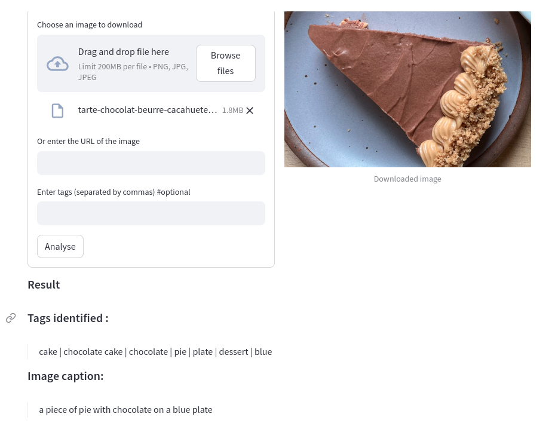

# Image Captioning and Tagging System

Un système avancé pour la reconnaissance d'images et la génération automatique de légendes descriptives.

## Description

Ce projet met en œuvre une solution complète de machine learning pour analyser le contenu des images et générer des textes descriptifs pertinents. Utilisant des techniques de pointe en vision par ordinateur et en traitement du langage naturel, le système peut reconnaître les éléments visuels et les décrire de manière concise et précise. Conçu pour être flexible et évolutif, il peut être intégré dans diverses applications, allant des aides à la navigation pour les malvoyants à la gestion automatique des actifs multimédias.

## Prérequis

Avant de commencer, assurez-vous d'avoir les outils suivants installés :
- Python 3.8 ou plus récent
- pip (Python package installer)
- Docker (pour la conteneurisation et le déploiement)

## Demo 



## Structure du Projet

views: Dossier pour les scripts Streamlit de l'interface utilisateur.
api: Contient le modèle de traitement d'image avec des scripts pour l'inférence + intéraction avec l'API.
main.py: Le point d'entrée principal de l'application Streamlit.

## Installation

Suivez ces étapes pour installer et configurer votre environnement de projet :

```bash
# Cloner le dépôt (si applicable) - assurez-vous que git est installé sur votre système.
git clone https://github.com/drogbadvc/image-captioning.git
cd image-captioning

# Il est recommandé de créer un environnement virtuel
python -m venv venv
source venv/bin/activate  # Sur Windows utilisez `venv\Scripts\activate`

pip install -r api/requirements.txt

# Téléchargez le modèle pré-entraîné depuis Hugging Face et placez-le dans le dossier 'api/pretrained'
wget https://huggingface.co/spaces/xinyu1205/recognize-anything/resolve/main/tag2text_swin_14m.pth
```

## Utilisation de Docker

# Construire l'image Docker à partir du Dockerfile
docker build -t image_captioning_tagging_system .

# Exécuter le conteneur à partir de l'image construite
docker run -p 8501:8501 -p 8000:8000 image_captioning_tagging_system

Avec Docker, l'application Streamlit sera accessible via http://localhost:8501 et l'API FastAPI via http://localhost:8000.


## Utilisation

Pour démarrer l'application, utilisez la commande suivante :

```bash
streamlit run main.py
```

Ouvrez votre navigateur et allez à l'adresse indiquée par Streamlit, généralement http://localhost:8501.


## Licence

Ce projet est distribué sous la licence MIT. Voir le fichier LICENSE pour plus d'informations.

## Source

https://huggingface.co/spaces/xinyu1205/recognize-anything/blob/main/tag2text_swin_14m.pth